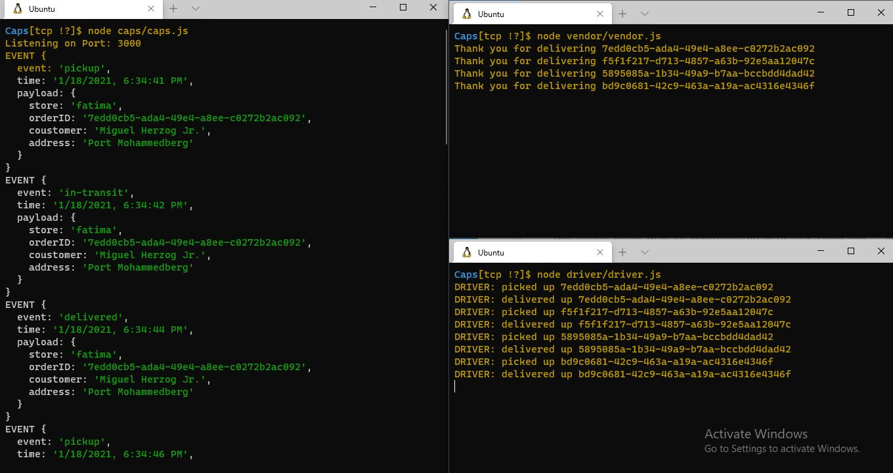
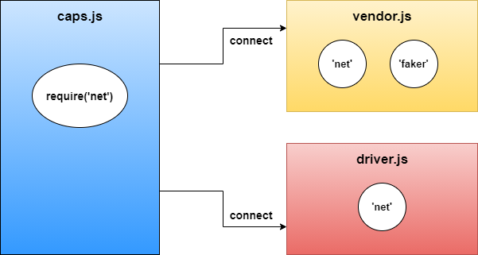

# Caps

### Author: Fatima Atieh

## Setup

Make directories for `caps` `vendor` `driver` and do `npm init -y` for each by itself so you will have `package.json` file for each directory

`npm i dotenv faker jest`

Add `STORE_NAME` `PORT` `HOST` in `.env` file

Start the server using `node cpas/caps.js` , `node vendor/vendor.js` , `node driver/driver.js` by splitting the terminal window to three parts or open 3 terminal windows and run each commapn on a different part to see the connection between the servers

## Testing

You will get a result similar to the following:

## UML

