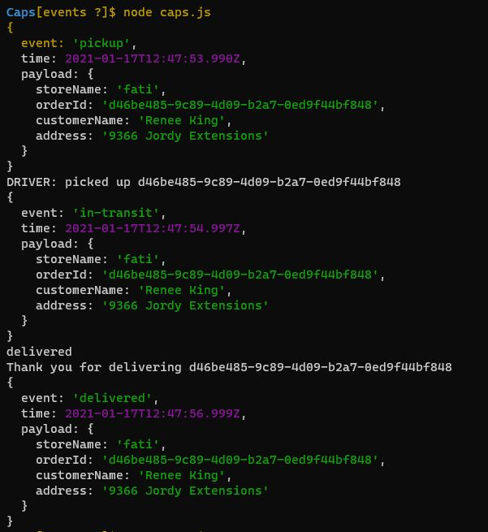
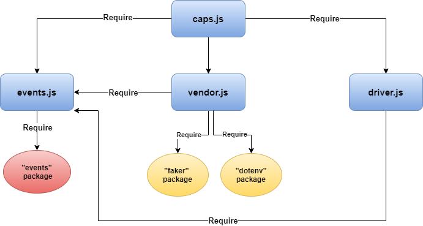

# Caps

### Author: Fatima Atieh

## Setup

`npm i dotenv faker jest`

Add `STORE_NAME` in `.env` file

Start the server using `node caps.js`

You will get a result similar to the following:

## UML

